# An Instance-Based Account of Context Maintenance and Retrieval

<!--
So the title of this talk is pretty obscure! 

In that light, let me start by trying to make clearer what this is all about. 
-->

## Main Points
1. Research distinguishing two categories of models - **instance** and **prototype** theories - has driven progress in various areas of memory science, with instance theories increasingly prominent.
2. However, the relevance of this distinction to the study of memory search and free recall has so far gone unexplored, with prototype models receiving exclusive focus.
3. To bridge this disconnect between modeling traditions, I specify an instance-based version of an influential prototype-based model of memory search.
4. I compare the two models across various benchmark phenomena and datasets, finding an instance-based account of memory search largely compatible with the premises of the leading retrieved context account of memory search.

## Talk Outline
1. Definitions and Background
2. Model Specification
3. Accounting Data Without Item Repetitions
4. Variable List Lengths
5. Item Repetitions and Spacing
6. Discussion and Future Directions

## Memory and Memory Search
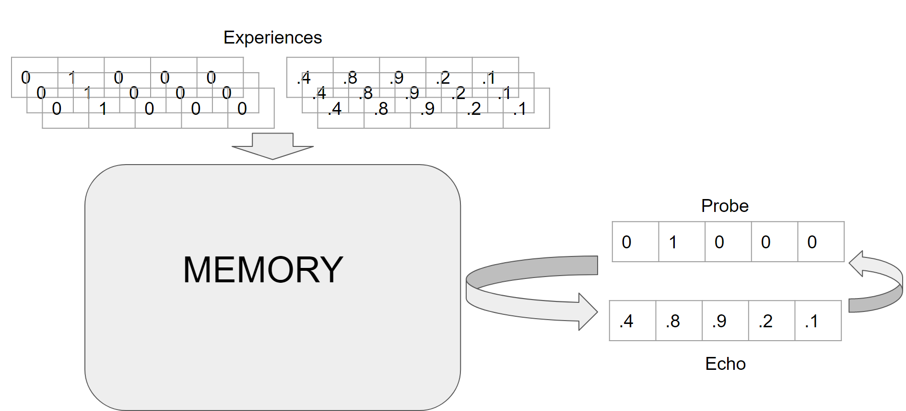

<!--
We can think about memory as system you can send a retrieval cue or "probe" to and then expect a reply or "echo"  from the system in response. The mapping between possible probes and echoes that a memory system supports is further understood to be dynamic with respect to experience. Memory scientists in general are  interested in developing really specific but broadly relevant accounts of how humans build, change, and access these mappings across a broad array of conditions.

In particular, this project concerns theories of memory _search_ - the way we can iteratively probe and reprobe our memory system to retrieve stored information perhaps more remote than what our environments might immediately cue us to recall. 
-->

## The Free Recall Task
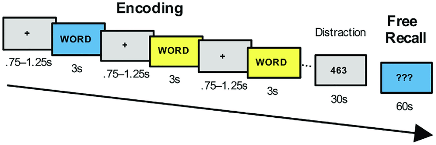
1. Study a specified sequence of items (usually words)
2. Can split with distraction task, delay, or cue recall immediately
3. Participants try to recall items _in whatever order they come into mind_

Has provided important constraints on memory search models.

<!--
In the formal study of memory search, few research approaches have been as influential as the free recall task paradigm. 

Under this paradigm, research participants are presented a sequence of items to memorize during a study phase. Later, after a delay or perhaps some distraction task, participants are prompted to recall as many items from the item sequence as possible. Critically, participants performing a free recall task are encouraged to recall sequence items in whatever order they come into mind. 

Since participants largely organize the course of retrieval themselves in the response phase of a free recall task, the order in which items are recalled under the paradigm have provided important constraints on accounts of the representations and mechanisms underlying search through memory to retrieve information.
-->

### Serial Position Curves
Curves relating study position and recall probability are traditionally U-shaped.
- **Primacy Effect**: early items exhibit heightened recall probability
- **Recency Effect**: late items exhibit heightened recall probability

Relative enhancement varies across tasks, subjects.
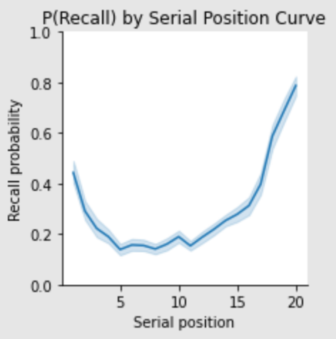

<!--
A few consistent regularities across experiments have received especial emphasis in accounts of performance on the free recall task. First, the position of an item within an presented item sequence --- its \textit{serial position} --- has been found to substantially affect its probability of being recalled \citep{murdock1962serial}. In a phenomenon called the \textit{primacy effect}, items positioned early in a sequence tend to exhibit enhanced recall probabilities compared to later-presented items. At the same time though, in a phenomenon called the \textit{recency effect}, the last few items presented in a studied sequence tend exhibit even larger enhancement of recall likelihood, resulting in U-shaped \textit{serial position curves} relating item serial position with recall likelihood across trials of free recall experiments. 
-->

### Probability of First Recall
Analyses focusing on probability of recalling an item *first* as a function of study position generally find strong support for early or late items depending on events between study and recall.

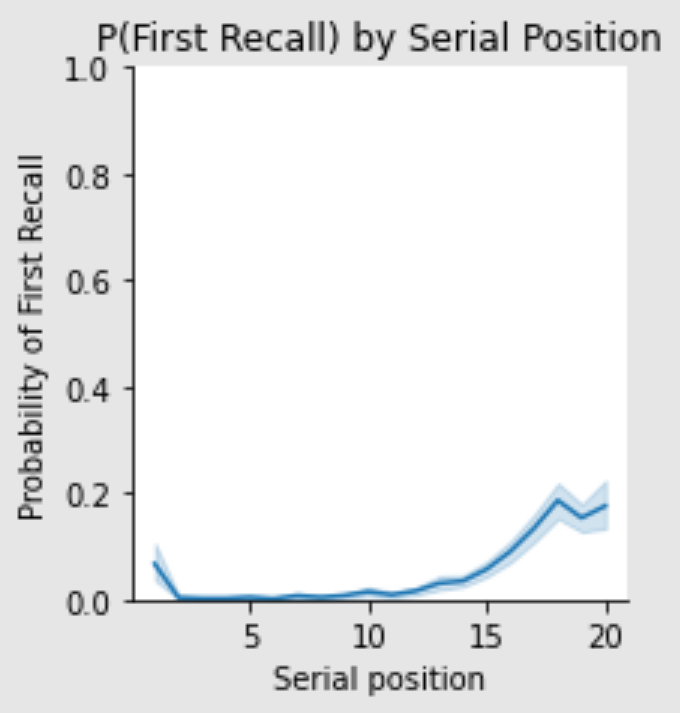
<!--
A similar but distinct pattern constraining accounts of memory search is found in analyses relating an item's serial position with the probability that it will be recalled first in the retrieval phase of experiments. Pivotally, in immediate recall tasks where recall starts all but as soon as list study stops, participants tend to initiate recall with the most recently studied items from the list; however, with delays, distraction, or explicit instruction as in the serial version of this task, participants tend to successfully recall the earliest presented items in a list first. Like serial position curves, these patterns suggest a complex relationship between when items are encoded during a free recall task and how they're eventually retrieved.
-->

### Temporal Contiguity
Items studied near one another tend to be recalled near one another.

This relationship exhibits a **forward assymetry**: transitions to successive items are much more common than previous.

**Lag-CRP** analyses visualize this by tracking recall probability conditioned on recall of an item studied $x$ positions away (lag).

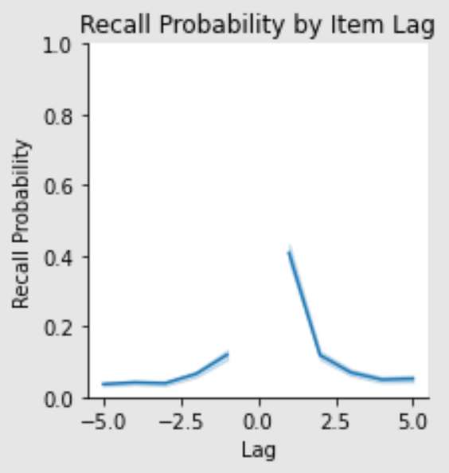
<!--
Nonetheless, temporal organization reliably pervades performance across the response phase of a recall task, not just for initial and terminal items or recall positions. Free recall task data exhibits a pattern called \textit{temporal contiguity} where items studied at nearby serial positions tend to be recalled near one another at the retrieval phase of an experiment. 

To quantify this pattern, researchers measure across trials the conditional probability of retrieving items given increasing iter-item lags between the serial positions of considered items and the serial position of the item last recalled. These \text{lag-CRP} analyses find that subjects reliably tend to make transitions between temporally contiguous items (that is, items presented near one another) during free recall. Furthermore, they exhibit a forward bias, recalling contiguous items presented after the last recalled item more frequently than items presented beforehand.

These three patterns are often characterized as benchmark phenomena in the study of memory search because accounting for their stability and their variation across subjects and task conditions is considered the bare minimum that a theory must achieve to be taken seriously in the field.  
-->

## CMR: The Retrieved Context Account of Memory Search
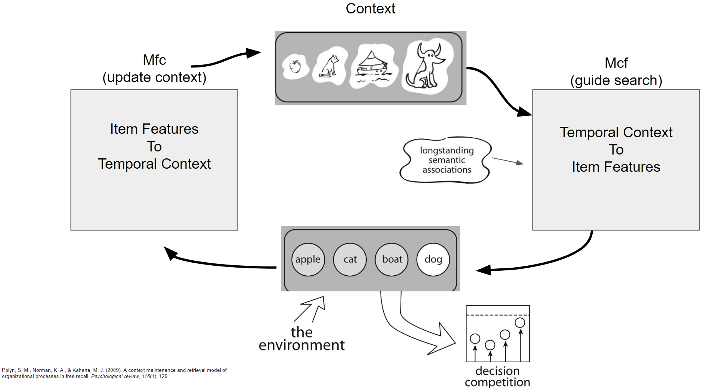

<!--
To account for these phenomena, the formal literature has largely converged on retrieved context theories of memory search. Generally, according to these theories, as items are encoded into a memory system, an internal representational of temporal context is also maintained that dynamically updates itself to reflect a weighted summary of recent experience. It starts out with content totally unrelated to the list, and gradually updates to reflect its recent content.

Over the course of experience, item features and the current state of this dynamic contextual representation are associated in memory such that reactivating units representing item features can cue retrieval of the corresponding contextual features, and vice versa. Factors like attention might enhance these strength of these associations depending on serial position, contributing to features like primacy, but this tango between context and item features are considered the core explanatory mechanism of the model.

By the time the retrieval phase comes, this contextual representation has drifted a bit back toward its pre-list content, especially if there was a big delay or a distraction task, also contributing to primacy. This contextual representation is proposed to drive memory search by activating associated item features and selecting items based on the resulting pattern. Correspondingly, retrieving an item reactivates its associated contextual features, updating context before the next recall attempt and enforcing temporal contiguity. 

ADD AN EXPLANATION OF FORWARD ASSYMETRY IN RECALL TOO

With these basic mechanisms, retrieved context models have been formalized within various computational models that can explain an increasingly broad class of phenomena, including not just serial and temporal organizational effects in sequence memory tasks \citep{polyn2009context,siegel2014retrieved,schwartz2005shadows}, but also aspects of domains including but not limited to financial decision making \citep{wachter2019retrieved}, emotion regulation \citep{talmi2019retrieved}, signal dynamics within the medial temporal lobe \citep{kragel2015neural}. Further model development has integrated retrieved context accounts of memory search with theories of semantic knowledge \citep{morton2016predictive} and aging-related change \citep{healey2016four}. Even this list probably underrates how broadly these ideas have impacted the field.
-->

## Prototype Models 
Under prototype models, repeated experience of an item under different contexts updates a prototypical representation of that item's contextual associations.

Performs all **abstraction at encoding**, not retrieval.

Examples: Linear Associator (right), LSA, word2vec
<!--
In other parts of the literature but not so much the one we just discussed, researchers have often set two basic types of memory models against one another. We can think of them as offering different answers to the question of what happens when you experience the same thing over and over again, but in different contexts - and later try to retrieve information about that contextual history. We can think of lots of situations where this sort of abstraction is really important. Maybe you're evaluating whether a person or potential food is a threat or not. Maybe you're just remembering what dogs are like.
 
 In prototype-based models, repeated experience of items under different contexts updates for each item a single prototypical representation of its contextual associations. Across many contexts, these representations becomes a distributed pattern of features that reflects each item's history of co-occurrence with other items, enabling you to retrieve information about one when later probed with information about the other.

Prototype-based models are hugely diverse and include most connectionist models, as well most of the distributional semantic models many of you may be familiar with such as LSA, word2vec, and so on. The key feature distinguishing prototype-based models is the correspondence of each item with a contextual representation that's static by the time retrieval happens.
-->
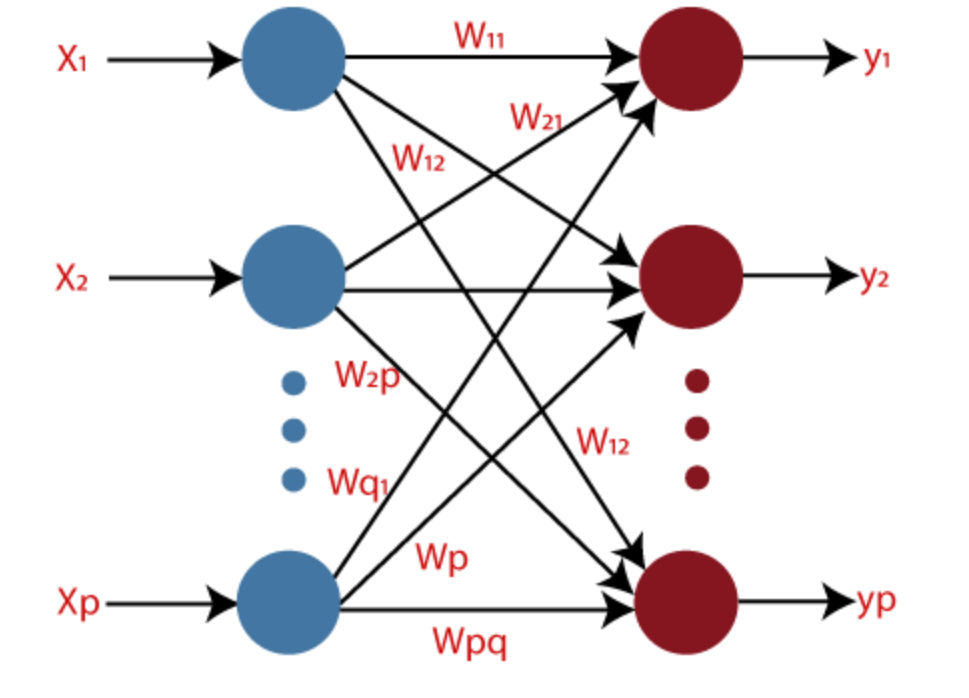

<!--
In the other corner, we have what I'll stick to calling instance-based models. Instead of proposing that we build a set of summative prototypical representations to support recall of item associations, instance theories conceptualize memory as a growing collection of distinct memory traces, each a record of a unique event or experience. When it's time to remember something, you build an abstractive representation of your reminder's associations on the fly. Your reminder simultaneously contacts every trace you have stored in memory. Based on the relevance of each trace to your reminder - usually represented as an amount of activation - its content figures a lot or a little or a moderate amount in the final representation you retrieve. The resulting weighted blend of information across past experience is the echo your memory system replies with.
-->

## Instance-Based Models
<!--
A classic and pretty influential example of an instance-based model is MINERVA 2. 
-->
Memory as a growing collection of distinct memory traces, each a record of a unique event or experience

During retrieval, probes contact each trace, activating each based on their similarity: $A(i) = S(i)^{\tau}$

Normalized sum of traces, weighted by activation, is the retrieved echo.

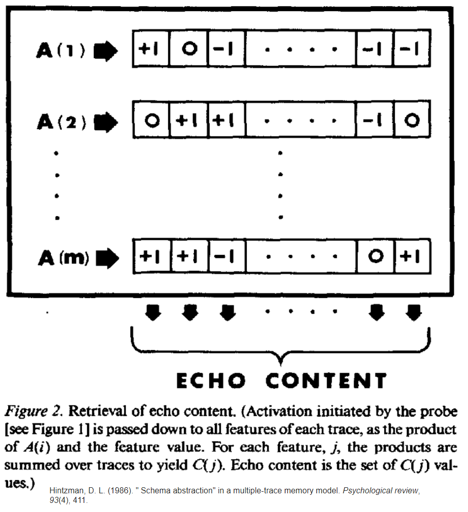

### Instance-Based Models: Also Highly Influential
"an established and classic theory for memory that has previously been applied to understand a suite of behaviors including... 
- recognition memory (Hintzman 1984),  frequency judgment (Hintzman 1988),
- cued recall (Hintzman 1986), classification (Hintzman 1986), 
- function learning (Kwantes and Neal 2006), judgment and decision (Dougherty et al. 1999; Thomas et al. 2008), speech normalization (Goldinger 1998), 
- confidence/accuracy inversions in eyewitness identification (Clark 1997), (i) language processing (Rosch and Mervis 1975), (j) false memory (Arndt and Hirshman 1998), (k) memory dissociations in aging (Benjamin 2010), (l) implicit learning (Jamieson and Mewhort 2009a, 2010, 2011), (m) speeded choice (Jamieson and Mewhort 2009b), (n) associative learning (Jamieson et al. 2010b, 2012), (o) the production effect in recognition memory (Jamieson et al. 2016a), ..."

>Jamieson, R. K., Avery, J. E., Johns, B. T., & Jones, M. N. (2018). An instance theory of semantic memory. Computational Brain & Behavior, 1(2), 119-136.

## Why The Difference Matters: Nonlinear Scaling of Trace Activations
Main difference between instance and most prototype models is not the timing of retrieval, but ability to select even rare contextual associations to an item from memory while suppressing more common contextual associations via nonlinear scaling of trace activations.

 $A(i) = S(i)^{\tau}$

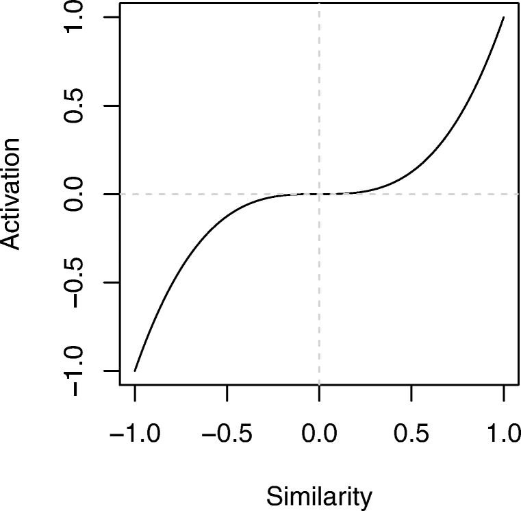
<!--
The advantages reported for instance-based over prototype-based models in these areas turn on access to abstraction mechanisms unavailable to most prototype models. If an instance-based model performs abstraction over experiences in the same way as a prototype-based model, it is inconsequential at least for predictions about the content of retrieved representations whether the abstraction occurs during encoding or retrieval. 

However, while prototype-based models discard information about individual exemplars \citep{metcalfe1992composite}, instance-based model architectures allow for nonlinear activation of the information stored in instances based on relevance to a cue. This nonlinear scaling is traditionally realized by applying an exponent parameter to measurements of similarity between a probe and each a stored instance. High values for this parameter increase the influence of highly supported traces in the final abstractive representation, while lower values drive the influence of each trace in the final representation toward uniformity.
-->

### Case Study: Semantic Memory (Jamieson et al, 2018)
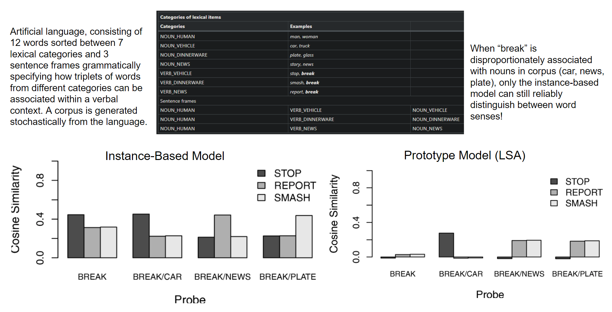

<!--
In literatures like categorization and in this example the semantic memory literature, this distinction enables instance-based models to flexibly retrieve the information in a memory system that is most relevant, even if that information only rarely occurs during learning. 

A recent work applies this logic to critique prototype-based accounts of semantic memory. \citet{jamieson2018instance} found that because prototype-based distributional semantic models such as latent semantic analysis \citep{dumais2004latent} and Word2Vec \citep{church2017word2vec} "collapse the many contexts in which a word occurs to a single best-fitting representation", they lose the ability to represent rare senses of homonymous and polymsemous words, resulting in measureable differences accounting for word similarity patterns in various natural language simulations compared to an instance-based account of semantic memory based on the MINERVA 2 multiple traces memory model \citep{hintzman1984minerva}. 

With respect to categorization, exemplar-similarity models that represent categories as sets of stored instances paired with a process for comparison against probes outperform prototype-based models only when allowed to vary a parameter allowing for nonlinear activation of stored instances \citep{nosofsky2002exemplar,  stanton2002comparisons}. 
-->

## Do These Issues Matter for Memory Search? Enter InstanceCMR
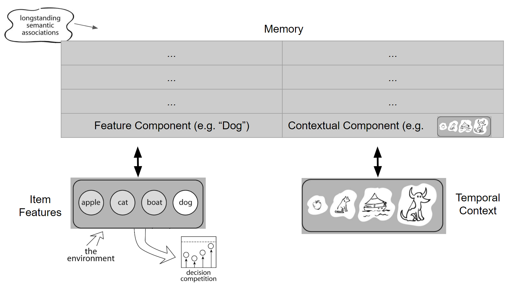
<!--
It is more ambiguous whether this distinction is equally consequential when it comes to accounting for performance on the free recall task. To help find out, we present and begin exploration of an instance-based implementation of the influential Context Maintanence and Retrieval (CMR) model of memory search \citep{morton2016predictive}. This instance-based CMR (InstanceCMR) extends the established MINERVA 2 multiple traces model \citep{hintzman1984minerva,hintzman1986schema,hintzman1988judgments} to support context-based memory search. Under neutral conditions where each unique item is presented only once across study phases (and thus abstraction across item contexts is an irrelevant capacity), InstanceCMR can account for benchmark phenomena traditionally used to evaluate models of memory search just as effectively as the original prototype-based implementation of CMR (PrototypeCMR). However, when unique items can be presented repeatedly across a study phase, meaningful differences emerge between how the models' predictions about the structure of retrieval dynamics, suggesting that experimental conditions exist that hamper dissociation of retrieved context accounts of memory search from the architectures within which they are implemented. We demonstrate the model and these findings using a collection of simulation analyses and by comparison to various behavioral datasets.
-->

### Architecture
Units with activity patterns representing features of studied items $F$ and units representing current temporal context $C$ interact over the course of a list-learning experiment. 

Item representations are assumed to be orthonormal to each other: each unit of $F$ corresponds to support for one particular item. Corresponding units of the model's context representation $C$ encode information about these items as well to track temporal history, However, additional units enable context to be set orthogonal to possible item representations too.

When an item is presented during a list-learning experiment, memory for each experience is in turn encoded as a separate row in an $m$ by $n$ memory matrix $M$ where rows correspond to memory traces and columns correspond to features,

$$M_i = (f_i, c_i)$$

### Pre-Experimental State
To set pre-experimental associations, a trace is encoded into memory for each relevant item. Each entry $j$ for each pre-experimental feature vector $f_i$ is set according to

$$f_{pre(ij)} = \begin{cases} \begin{alignedat}{2} 1 - \gamma \text{, if } i=j \\
          0 \text{, if } i \neq j\\
       \end{alignedat} \end{cases}$$

This connects each unit on $F$ to the corresponding unit on $C$ during retrieval from a partial or mixed cue!

Similarly to control pre-experimental context-to-item associations, entries for each pre-experimental context vector $c_i$ are set according to:

$$c_{pre(ij)} = \begin{cases} \begin{alignedat}{2} \delta \text{, if } i=j \\
          \alpha \text{, if } i \neq j\\
       \end{alignedat} \end{cases}$$

$\delta$ works similarly to $\gamma$ here while $\alpha$ parameter alternatively allows all the items to support one another in the recall competition in a uniform manner.

### Probing Memory: Cosine Similarities Between Traces Organizes Retrieval
While CMR access $M_{CF}$ or $M_{FC}$ to perform retrieval, we act on a single memory store (a MINERVA-like stack of traces), comparing probes with either contextual or feature information to each trace and performing a weighted sum of activations:

$$a_i = \left({\frac {\sum^{j=n}_{j=1}{p_j \times M_{ij}}} {\sqrt{\sum^{j=n}_{j=1}{p^2_j}}
        \sqrt{\sum^{j=n}_{j=1}{M^2_{ij}}}}}\right)^{\tau}$$

Trace activations are linearly modulated based on list position and probe content. When item feature units are nonzero, $\gamma$ controls the relative influence of pre-experimental associations.
$$a_{exp(i)} = \gamma \cdot \left({\frac {\sum^{j=n}_{j=1}{p_j \times M_{ij}}} {\sqrt{\sum^{j=n}_{j=1}{p^2_j}}
        \sqrt{\sum^{j=n}_{j=1}{M^2_{ij}}}}}\right)^{\tau} \text{ if } p_f \neq 0$$

### Probing Memory: A primacy gradient modulates context-based retrieval
When there is contextual information in the probe ($p_c \neq 0$), activation for traces encoded during the experiment are modulated by $\phi$

$$a_{exp(i)} = \phi_i \cdot \left({\frac {\sum^{j=n}_{j=1}{p_j \times M_{ij}}} {\sqrt{\sum^{j=n}_{j=1}{p^2_j}}
        \sqrt{\sum^{j=n}_{j=1}{M^2_{ij}}}}}\right)^{\tau} \text{ if } p_c \neq 0$$

where $phi_i$ scales the amount of learning, simulating increased attention to initial items in a list that has been proposed to explain the primacy effect. $phi_i$ depends on the serial position $i$ of the studied item:

$${\phi}_i = {\phi}_se^{-{\phi}_d(i-1)} + 1$$

The free parameters $phi_s$ and $phi_d$ control the magnitude and decay
of this learning-rate gradient, respectively.

### Probing Memory: Integration over Trace Activations at Retrieval
In the echo step $E$, a weighted sum of the traces - called an echo - is retrieved where each trace is weighted by its corresponding activation.

$$e_j = \sum^{i=m}_{i=1}\sum^{j=n}_{j=1}a_i \times M_{ij}$$

where $e_j$ is feature $j$ in the echo, $m$ is the number of traces in memory, $a_i$ is the activation of trace $i$, and $M_{ij}$ is the value of feature $j$ in trace $i$ in memory.

<!--
While a partial probe may exclude contextual information (or vice
versa), traces containing contextual information are still activated
based on the content of the included feature information. The retrieved
echo thus contains a representation of the contextual information
associated with the probe feature vector $f_i$.
-->

### Updating Context as Items Are Encoded
When an item $i$ is presented during the study period, its representation on $F$, $f_i$, is activated. Pre-experimental context $c_{i}^{IN}$ is retrieved using the two-step echo $E$ mechanism described below by presenting $(f_i, 0)$ as a probe to memory. The input to context is retrieved by

$$(\_ , c_{i}^{IN}) = E\left[(f_i, 0)\right]$$

where the contextual features of the retrieved echo determine contextual input. The retrieved pre-experimental context is then normalized to have length 1.

After retrieval of pre-experimental context $c_{i}^{IN}$, the current state of context is updated according to:

$$c_i = \rho_ic_{i-1} + \beta c_{i}^{IN}$$

Where $\beta$ is set to $\beta_{enc}$ and ${\rho}_i$ is set so that the length of $c_i$ is 1 (equation excluded).

<!--
After context is updated, the current item $f_i$ and the current state
of context $c_i$ become associated in memory $M$ by storing a
concatenation of the two vectors as a new trace according to Equation 1.
-->

### Starting Memory Search
Before initiating recall, we assume that some amount of the pre-list context is reinstated. We assume that context is updated according to

$$c_{start} = \rho_{N+1}c_N + \beta_{start}c_0$$

where $c_{start}$ is the state of context at the start of free recall, $N$ is the number of items in the list, $c_0$ is the state of context at the start of the list before any item presentation.

At each recall attempt, the current state of context is used as a retrieval cue to attempt retrieval of a studied item. 

### Computing Recall Probabilities
First, the activation of each trace is determined using the current state of context as the probe.

We further calculate the probability of stopping recall (where no item was recalled and search terminated). It varies as a function of output position $j$ (where $j=0$ for the first attempt), according to

$$P(stop, j) = \theta_se^{j\theta_r}$$

where $\theta_s$ and $\theta_r$ are free parameters that determine the scaling and rate of increase, respectively, of the exponential function.

The probability $P(i)$ of recalling a given item is defined conditional on recall not stopping at that position, and varies with the intensity of corresponding item features $e_i$ in the retrieved echo, according to

$$P(i) = (1-P(stop))\frac{e_i[(c_i, 0)]}{\sum_{k}^{N}e_k}$$

### After Retrieval

If a trace is recalled, then the item with the most similar feature representation is reactivated on $F$. The reactivated item is then used to retrieve a representation of context according to

$$c_i^{IN} = E[(f_i, 0)]$$

Context is then updated using the mechanism for it specified in the above section, and is used to cue for another recall attempt. The process continues until the model reaches the end of the recall sequence.

## Correspondence with CMR: Encoded Representations
While InstanceCMR builds associations between feature representations and temporal context by stacking traces and integrating across them at retrieval based on similarity to a probe, CMR applies Hebbian learning within linear associators to build prototypical representations of feature-to-context and context-to-feature associations within two matrices, $M_{FC}$ and $M_{CF}$. 

Since Hebbian learning is also effectively a weighted sum across experiences, the resulting representations a highly similar!

To confirm this intuition, using the state of an InstanceCMR instance after encoding 20 uniques items, we computed and visualized a "latent" $M_{FC}$ and $M_{CF}$ by probing the model with unit vectors corresponding to each unique $F$ and $C$ unit and stacking the resulting vector into compressed matrices.

## CMR's $M_{FC}$ and InstanceCMR's Latent $M_{FC}$
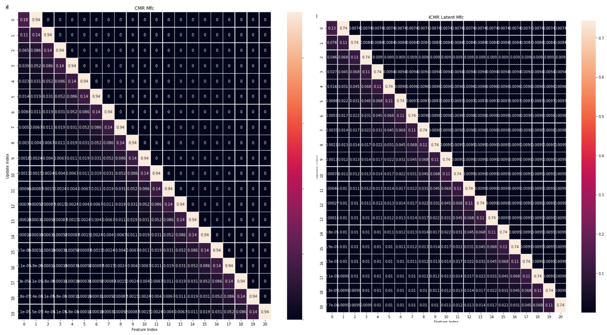

## CMR's $M_{CF}$ and InstanceCMR's Latent $M_{CF}$
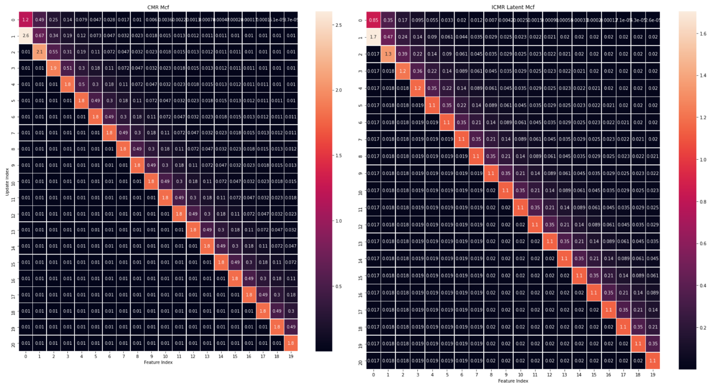

## Distinguishing CMR and InstanceCMR: Echo vs Trace-Based Nonlinear Scaling of Activations
By representing item features as orthogonal unit vectors, CMR can apply its own $\tau$ exponent parameter to echoes (not traces) retrieved using $M_{CF}$, enhancing highly supported and suppressing recall of weakly supported items without distorting retrieval:

$$P(i) = (1-P(stop))\frac{e_i[(c_i, 0)]^{\tau}}{\sum_{k}^{N}e_k^{\tau}}$$

To help explore the distinction between $\tau$-based modulation of item supports at the echo level as opposed to the trace level, we also consider in some analyses a version of InstanceCMR that does the same, reserving the exponent for modulating item support during free recall instead than modulating trace activations.

## Initial Model Comparison: Single Item Presentations

### Murdock, Okada, 1970
Each of 72 undergraduates was given 20 test lists with 20-word lists visually presented at either 60 or 120 words/min.

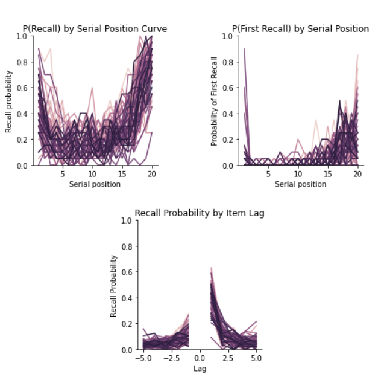

### Murdock, Okada, 1970
Whether nonlinear scaling parameter applied to trace activations or retrieved echo, subjectwise fit distributions are close to identical.
 
 

### Variable List Lengths (Murdock, 1962)
A key feature of CMR is that the same model parameters can account for performance across list lengths, explaining unique benchmark statistics in terms of just that task feature. Can InstanceCMR do the same?

We use a subset of the classic Murdock (1962) dataset (20 items vs 30 items, immediate FR, 80 trials for each of 15 unique subjects)

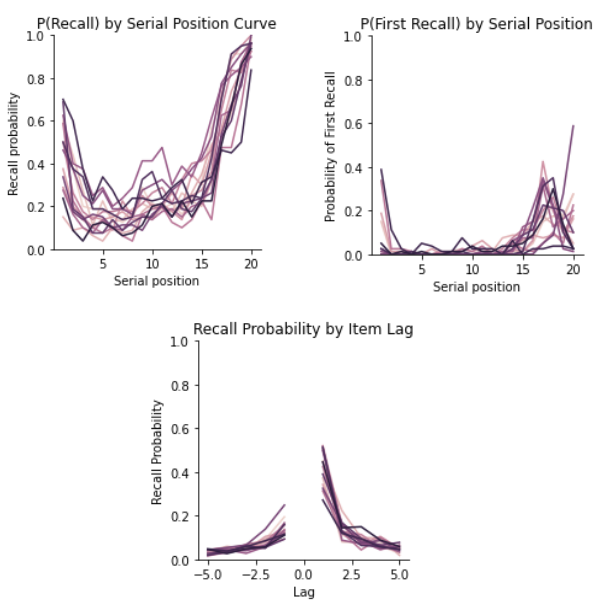

### Variable List Lengths (Murdock, 1962)
A key feature of CMR is that the same model parameters can account for performance across list lengths, explaining unique benchmark statistics in terms of just that task feature. Can InstanceCMR do the same?

We use a subset of the classic Murdock (1962) dataset (20 items vs 30 items, immediate FR, 80 trials for each of 15 unique subjects)

###

## Item Repetitions: $c^{\tau} + c^{\tau}$ vs ${(c + c)}^{\tau}$
InstanceCMR, like MINERVA 2, has the option to apply its sensitivity scaling operation (i.e. an exponent to each value) to activations of individual traces - that is, before integration into a unitary vector tracking retrieval support. 

CMR, on the other hand, has no access to any trace activations and thus applies its sensitity scaling to the integrated result. 

Given equal activations and $\tau$, this should result in far more dramatic increases in retrieval support as an item is repeated. 

Fitting $\tau$ might moderate these differences, but with the trade-off of weaker or stronger differentiation between strongly and weakly supported items - the purpose of these parameters!

<!--
The latter operation is hypothesized to more strongly differentiate strongly from weakly supported items than the former. Suppose a constant sensitivity parameter $\tau$ and that two distinct experiences each contributed a support of $c$ for a given feature unit in the current recall. Under trace-based sensitivity scaling, the retrieval support for that feature unit would be $c^{\tau} + c^{\tau}$. But under echo-based sensitity scaling, support would be ${(c + c)}^{\tau}$, a much larger quantity. 
-->

## Rationale
A straightforward way to initiate analysis of how the models might differentially handle item repetitions is to measure how the probability of recalling an item given a static contextual cue changes as the item is repeatedly encoded. We expect it to increase quasi-linearly (by $x^{\tau}$) with respect to `InstanceCMR`, but exponentially within `CMR`.

1000 experiments, random cue and random item repeated 50 times after first encoding 20 unique items.

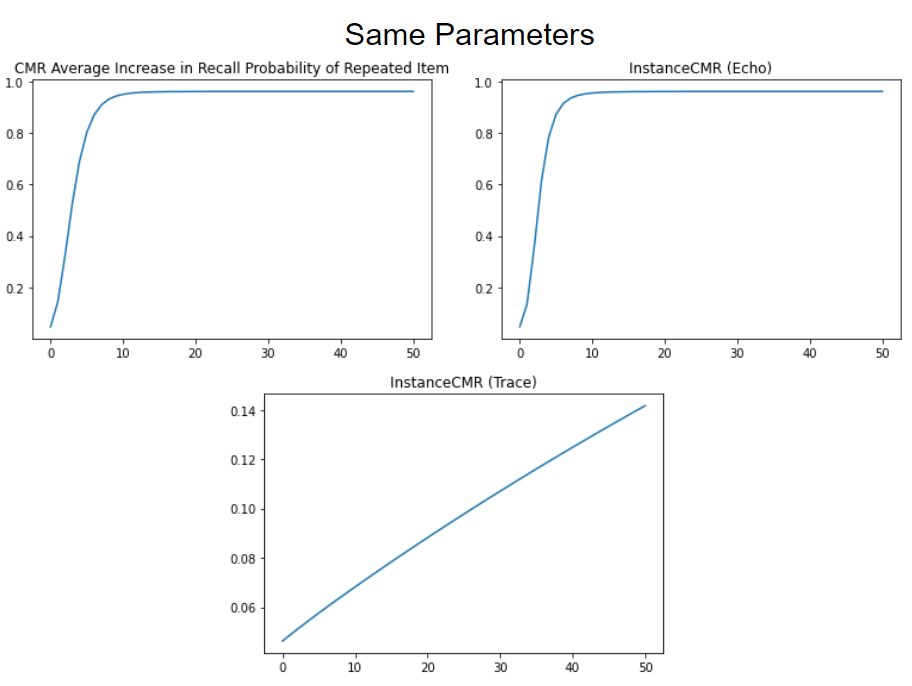

## Rationale
A straightforward way to initiate analysis of how the models might differentially handle item repetitions is to measure how the probability of recalling an item given a static contextual cue changes as the item is repeatedly encoded. We expect it to increase quasi-linearly (by $x^{\tau}$) with respect to `InstanceCMR`, but exponentially within `CMR`.

1000 experiments, random cue and random item repeated 50 times after first encoding 20 unique items.

## Lohnas & Kahana (2014)
Across 4 sessions, 35 subjects performed delayed free recall of 48 lists with up to 40 items. 

Subjects encountered four different types of lists: 
1. Control lists that contained all once-presented items;  
2. pure massed lists containing all twice-presented items; 
3. pure spaced lists consisting of items presented twice at lags 1-8, where lag is defined as the number of intervening items between a repeated item's presentations; 
4. mixed lists consisting of once presented, massed and spaced items. Within each session, subjects encountered three lists of each of these four types. 

<!--
Subjects were University of Pennsylvania undergraduates, graduates and staff, age 18-32. List items were drawn from a pool of 1638 words taken from the University of South Florida free association norms (Nelson, McEvoy, & Schreiber, 2004; Steyvers, Shiffrin, & Nelson, 2004, available at http://memory.psych.upenn.edu/files/wordpools/PEERS_wordpool.zip). Within each session, words were drawn without replacement. Words could repeat across sessions so long as they did not repeat in two successive sessions. Words were also selected to ensure that no strong semantic associates co-occurred in a given list (i.e., the semantic relatedness between any two words on a given list, as determined using WAS (Steyvers et al., 2004), did not exceed a threshold value of 0.55).
-->

## Lohnas & Kahana (2014): Cross-Subject/Trial LLs:
CMR: 41497.26322521102
InstanceCMR (echo): 41705.95666110226
InstanceCMR (trace): 41755.575092051775

parameter_count = 13
events: ~33,600

## Discussion