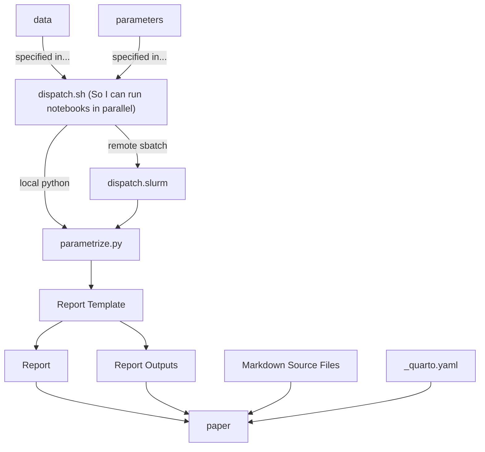

A core bash file named `{project_tag}_dispatch.sh` specifies a data path (`DATA_PATH`), section tag (`SECTION_TAG`), and other report template parameters (e.g., `TRIAL_FILTER`) unique to each report that will be generated.

```bash
PARAMETER_SCRIPT='instance_cmr_evaluation_dual'
DATA_PATH='../data/Murdock1962.csv'
SECTION_TAG='Murdock1962'
TRIAL_FILTER='subject > -1'

python ${PARAMETER_SCRIPT}.py ${DATA_PATH} ${TRIAL_FILTER} ${SECTION_TAG}

sbatch --job-name="${SECTION_TAG}_${PARAMETER_SCRIPT}.run" --output="${PARAMETER_SCRIPT}_${SECTION_TAG}.out" --export=ALL,PARAMETER_SCRIPT="${PARAMETER_SCRIPT}",DATA_PATH="${DATA_PATH}",TRIAL_FILTER="${TRIAL_FILTER}",SECTION_TAG="${SECTION_TAG}" dispatch.slurm
```

The bash file also specifies a python script (`PARAMETER_SCRIPT`) that uses papermill to parametrize and execute its corresponding report template, ending in an operation like...

```python
papermill.execute_notebook(
    "Subjectwise_Model_Evaluation.ipynb"
    "reports/Subjectwise_Model_Evaluation_Double_{section_tag}.ipynb".format(
        section_tag=section_tag
    ),
    parameters=dict(
        data_path=data_path,
        trial_query=trial_query,
        model_paths=model_paths,
        model_names=model_names,
        free_parameters=free_parameters,
        bounds=bounds,
        fixed_parameters=fixed_parameters,
        section_tag=section_tag,
    ),
    request_save_on_cell_execute=True,
)
```

responsible for parametrizing the report template and triggering generation of the corresponding report using papermill. To work, it must access a report template notebook and generate a separate report notebook that is based on the report template. Along with a report notebook, report assets including figures and simulated data are also generated.



So along with alting between python and slurm, I need to make paths consistent between remote and local. Otherwise the crossplay won't work. But if I make this work locally and then git clone next time I want to sbatch, that won't be a problem.

What's the local flow that I'm looking for?

- `data/` host data, both actual and simulated. I can eventually enable LFTS to help monitor larger files.
- `report_templates/` hosts templates separate from results
- `results/` can host figures that are project generic
- `projects/{project_name}/figures` should host figures that are project specific
- `dispatch.slurm` and anything else general across every report I might make with a corresponding template are assets of `report_templates/` 
- `dispatch.sh` and `parametrize.py` are project specific but can also be generalized and drafted in report_templates. 

I guess I'm working toward a project specific dispatch file that uses report templates and parameter variations to generate the subset of reports I actually want for my paper and then call quarto to integrate all that into a paper draft. 

Sometimes, I just want to generate everything to generate everything. And in the interim, I'll often want that to live in my paper draft anyway as an appendix. 

If so, then one additional element in this equation is `_quarto.yml` and the markdown files that wrap around my results to make a paper. 

I don't want to manually specify in `_quarto.yml` each file that I want to include in the draft. So eventually I'll have the report template or parametrizing script do that automatically.

Does my sketch even support parallelization? [This stackoverflow answer](https://stackoverflow.com/questions/18197395/have-bash-script-execute-multiple-programs-as-separate-processes) outlines how to manage parallelization correctly.

I'll keep generic `parametrize.py` and `dispatch.sh` files in the report_templates directory. They should support dispatch for every parameter variation I'm interested in, and run almost instantly if relevant results already exist. Report figures should technically live in the notebooks as well as a remote results folder, so quarto might be able to point to them even if reports live elsewhere. Otherwise, I copy assets over programmatically.

So what now? 

How will I actually execute things?

I'll open the dispatch file and a bash terminal within VSCode, highlight the configurations I'm interested in and paste everything in. This means operations will execute at project root.

If the code operates at project root, then I'm pointing to data correctly already. I'm not pointing to my parameter script correctly. Also, this whole time I actually had two parameter scripts.

Okay, this seems just about implemented from the report generation side. Next is...integrating all this into the pdf.

As a trial run, I'll try appending a report in reports/ to `_quarto.yml` in icmr and then clean up the formatting if that succeeds and then automating inclusion of other reports if that succeeds.

```python
with open('_quarto.yml', 'a') as f:
	f.write()
```