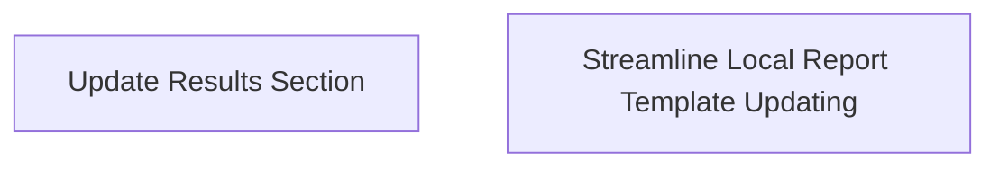

I noticed a little tension yesterday finding things. Much of my narrative code is not in the repo where I expected it to be (e.g., the notebook where I reproduced Becky's poster). I also have not refactored stuff like my work with jsPsych/JATOS. 

I had trouble finding specific notes and references, too. That's a downside of pooling everything into one note vault. I need to tackle this, or eventually, I'll drown.

Need to send Claire the reference list(s).

I want to try doing one small thing for every project every day. Is that realistic? IDK, but it sounds fun. Let's see.

## ICMR
Results section update, introduction update. It's very straightforward. Just do it.

I know it's not really so straightforward. Maybe a little flowchart action will help here too.

Problem is enabling mass updates to results based on changes to my report template.



## autocurator
I need to set up a remote coding environment and other project dependencies. Big hope is that I can work in VSCode rather than Jupyter as I did before.

This is effectively done. What will happen next? Probably a revisit of the scraping code. Goal condition: get the current patch retrieved. Or just part of it, really.

## Narrative
Meeting with Claire convinced me we have lots of points of possible collaboration. But I must follow through for that to work: I need to establish that my model and codebase are relevant for studying narrative comprehension and memory. This means developing and validating a model that can account for narrative recall data and making reasonable predictions about the reading process. 

The flowchart I propose in [[2022-2022-06-15 Narrative Stuff]] further outlines how to do that, though it's missing comprehension effect analyses and the details of paper preparation. I must refactor that and other relevant content into a high-level project planning document. I think the flowchart is the only main thing to port over.
AWQ
**What's the small thing I can do for this project?** Implement a semantic CRP analysis that I can use inside my model comparison report template.

Implementing another model is potentially a wrong first step. I won't know if the implementation is sound until I complete several other steps.  What's a component of the flowchart that I 
1) already have validation mechanisms prepared for and 
2) brings me closer to the success state I'm interested in?

If I just fit Base CMR to an existing data set, I have not done anything new to help understand semantic memory. But there are also the semantic analyses I haven't implemented yet. Base CMR should have no way to account for them. And there should be issues in my data pipeline that prevent me from running the analysis on my existing data. But by implementing the analysis, I effectively design a goal condition for the data and the model gaps in my finished code. 

```mermaid
flowchart TD;
Model[[Implement CMR Variants]]
Model1[Base CMR]
Model2[Semantic PCMR]
Model3[/Semantic ICMR/]
New_Model[/Resonant SCMR/]

Fitting[[Fit CMR Variants to Data]]
Baseline[Healy & Kahana, 2015]
Narrative[Cutler et al, 2019]
Novel_Data["Novel Lohnas-Like Dataset(s)"]

Reproduce[[Reproduce Results From Morton & Polyn 2016]]
Result1[Log-Likelihoods] %% slightly better total LL
Result2[CRP by Semantic Similarity] %% CRP as function of semantic similarity
Result3[Persistence of Semantic Organization] %% Semantic organization Score b/t Lags of 2+
Result4[Benchmark Summary Statistics]

Novel1[Semantic Neighbor Contiguity]
Novel2[Semantic Spacing Effect]
Novel3[Other Classically Repetition Effects?]

Model --> Model1 --> Fitting
Model --> Model2 --> Fitting
Model --> Model3 --> Fitting
Model --> New_Model --> Fitting 
Fitting --> Baseline 
Fitting --> Narrative 
Fitting -.-> Novel_Data
Baseline --> Reproduce 
Novel_Data --> Reproduce 
Narrative --> Reproduce
Novel_Data -.-> Novel1 & Novel2 & Novel3
Reproduce --> Result1 & Result4 & Result2 & Result3 
%% Result1 & Result4 & Result2 & Result3 & Novel1 -.-> Goal1[[Integrated Account of ]]
```
