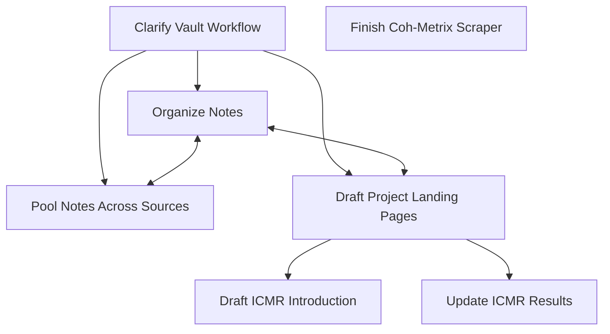

## 9:10
~~First I work on [[Vault Workflow]] to clarify role of Daily Notes. I want them to act as directories/diaries just stating what I worked on but containing no new ideas. Initially they can contain whatever, but I have to spend time refactoring the important stuff so that everything in my daily notes are redundant.~~

## 9:20
~~This makes me decide to go through all my daily notes to refactor useful content into named notes and remove unnecessary content.

~~[[2022-05-31 ICMR Results Roundup]] is me walking through the results I obtained across datasets. There's not enough context for me to know if this is up to date or what use it has now. Implies I need a workflow for ensuring notes are useful when I return to them weeks later. 

~~Sean already has his interpretation of my results that differ from how I would do it. I will probably want to redo the note after regenerating my results. Stick this note in archive for now. Is there a way to make the web exclude files in specific subdirectories or based on other conditions?~~

## 9:29
[[2022-06-01]] has the message I sent to Sean reporting tentative outcomes of my [[Subtle Contrasts in ICMR Evaluation]] model comparison. It would be useful to integrate the two notes in some way instead of maintaining the daily note. 

Is there anything else in the message?

Includes a summary of my concern about ICMR's tendency to generate very small probabilities that simulations often round down to 0. Could this throw off the fitting algorithm? Or is it sufficient to address the issue at the source by treating zero probabilities as nonzero within my likelihood function? I don't know yet. This should be one of my "Issue Notes".

This note is something I should return to. Sean dismissed my concerns; maybe he'll feel differently after I send him the updated results. Major topic of next meeting.

## 9:40
[[2022-06-04]] also requires too much reading to understand its context. But it's a scratch note so it's fine. This is where I draft my plans for a projects-wide obsidian vault and workflow. Can return to these notes when developing the [[Vault Workflow]] notes. Anything nonredundant? Some ideas about how to coordinate results. Also a lot of reflection on gaps in my ICMR results. I listed notebook cleanliness, robust fitting, logsumexp trick as big todos. I ended up ditching logsumexp and robust fitting. Notebook cleanliness is put off for after I actually integrate notebooks into paper. Hmm. I can probably archive this note. It's been mostly refactored.

## 9:51
[[2022-06-07]] is kind of deprecated. Important thing to remind myself about workflow is that I want to move from writing notes and THEN adding them to paper toward adding notes to paper as soon as I know they'll be there -- and even before, including them as an appendix. There's still a gap in my workflow about how to efficiently update project yml and overleaf copy without jumping between files too much. Also brings up landing page idea. I can archive this.

## 9:55
[[2022-06-13]] these are notes from my monday meeting about Sean. A lot here is too vague to use. We basically clarify a goal for the rest of ICMR: not to discourage work with PCMR, but encourage work on ICMR. What we have so far merely shows that ICMR is doable. Rest of paper needs to properly demonstrate why it's worth using. I suggested we had two potential angles:
- **Unification with Other Instance Models**. Argue that ICMR can be more readily integrated with other models built using an instance-based architecture than PCMR. We can find a phenomena for which a) data is public, b) a good instance-based account already exists, and ideally c) RCT can contribute additional insight into. But that third one is not truly necessary. The key is to show that a model variant is possible that does the things the selected instance model can do without breaking what ICMR is capable of. Provide a recipe for unification and prove it works.
- **Strong trace selection**. Argue that ICMR's strong trace selection mechanism makes it easier for the model to account for certain phenomena that PCMR struggles with. This is probably something where memory for recalling specific episodes is relevant. So far it seems dubious that any exist in free recall per se, but some variants of ICMR I developed for RepFR seem capable. 

This suggests that my nearest increment on this effort is to add both my additional repetition effect analyses and my innovative ICMR variants to the reporting pool. Maybe Sean will like one of the ways I've tackled the effect.

Other important new info: Sean wants a take on Lelman and Malmberg's instance model. 

Suggested work model where I give Sean regular deliverables, see him more often. I didn't pull it off this week. But maybe I can improve myself and do it w/ the flow I'm modeling now. Unsure.

Sean wants me to prioritize making the story clear and accessible. It seems I've been putting off the intro section stuff for months or even a year now.

I can archive this note, but further organization is needed.

## 10:10
[[2022-06-15]] I already partially refactored some narrative notes. I guess I'll have to consider that too here.

[[2022-06-15 Narrative Stuff]] is my work before meeting claire, plus my practice with mermaid. Stuff about Claire meeting isn't too useful, except my realization that meetings are a way I feel productive without doing things. Deprecated plans about SCMR. I can archive this.

Autocurator notes seem kind of up to date? This stuff should be in a landing page instead of a daily notes things. I can't leave decisions about what to do in a daily note either. Big thing is decision that my next clear TODO for autocurator is refreshing the web scraper.

Some notes for workflow issues. That's not archive material. I'll refactor it out then archive the broader note.

## 10:16
[[2022-06-16]]. Yesterday's notes. Notes I have trouble finding things and am missing files. I've already noted that. 

Odd goal to do one small thing for every project every day. That's not a clear enough mindset. I can do better.

Suggestion that I make flowchart to facilitate focus on clear goals is explored for ICMR. I'm already going to do that.

Narrative notes are huge. I have to refactor into landing page as planned but it sort of models a way I can find tasks to focus on. Writing code for new models is a bad step if I don't already have code that would prove the new model code works. So in general, I should write the applicable analysis code first, make sure it works within my data pipeline, and demonstrate a gap in my pre-existing model before I move on to developing novel model constructs. For narrative_cmr, that initially means getting the semantic crp working within my current report pipeline.

Has a decent mermaid diagram here that helped me think this stuff through. I kind of want to make one for compmemlearn in general. But if it gets too big, I can't really see it inside my document?

## 10:24
When I add the extra text to daily notes to indicate whawt the note was for, I lose the ability to grab it in calendar. I should make sure there's still a root daily note that points to that stuff. What notes are left?

[[2022-05-15 Introduction Planning]] a whiny scratch file exploring what I'm going for in my introduction. I pray I have something better. Some goals though...

> What is it that I want to cover in my introduction?
> 
> I want to review the entire literature that contrasts instance- and prototype-based models and explains why the distinction is essential.
> 
> I want to introduce the free recall literature and produce principled reasons this debate is relevant to the problem of memory search as well.
> 
> I want to enumerate how an instance-based memory differs from a prototype-based memory and lay out the consequences for model performance.
> 
> I want a well-motivated research approach for clarifying the significance of these distinctions in the context of memory search research.

Also reminds me of idea to driving writing with test conditions sort of how I might use test-driven development to focus progress on code.

## 10:29
Every remaining note in priority is genuinely valuable. Need to make sure they don't get lost in the pile. That's probably key for any further vault organization.

I'm tired? I will take a break.

## 11:30
Break was long! Think any break that involves continuing to look at this screen is not a real break, by the way. 

Headers marking the time isn't useful. Doesn't help find information later.

What now? Hopefully everything worth returning to is below. 

Start with low hanging fruit.

What's left? Summarize remaining issues after clearing low hanging fruit.

- I'm dissatisfied with notes organization. A lot of notes in priority are islands. My notes surrounding references seems to be all over the place, too. I have notes and other assets that aren't in compmemlearn at all. Instead they're in google drive, island repos, specified as github issues, onenote, nebo, stray pieces of paper, google keep. I want to centralize it all. I have to be careful digging into that, because it's a time suck. But progress on that will help with everything else.
- I seem to want to update my workflow document with lessons from this long ass note. 
- I want to better systematize my landing page thing. Requirement that goal clarification doesn't just live here means I need places in my vault where this stuff "belongs"
- Need to do actual work for ICMR intro and results generation.
- There are increments for narrative project that I feel like doing today too (e.g., coh metrix scraper)

## 13:00
I can do notes organization and pooling from anywhere, so I'll focus first on the stuff relevant to ICMR.

Notes working through issues shouldn't be here; I won't be able to find them again if I do. So it's time to start refactoring notes away. I'll use Issues notes for non-redundant task-focused writing. 

[[Planning the ICMR Landing Page]]

## Priority Issues
Review and better organize other priority notes

Introduction expansion is a task I need to make doable.

Along with updating results section, I need to organize my and Sean's provided thoughts about issues presented in notes like [[2022-06-01]]. 

Notes surrounding the small numbers issue especially troublesome in ICMR need to be organized. [[2022-06-01]] has some. I probably have others elsewhere? 

Organize notes around the "ICMR extensions" that Sean is interested in. I can probably stick landing page right in the draft.

Need issue note for local batch processing goal. Some notes in [[2022-06-15]].

Need landing pages for key projects instead of recording progress clarifying goals/etc in daily notes.

## Stray Issues
Workflow should streamline idea of "test-driven development" for texts rather than just code.

When I add the extra text to daily notes to indicate what the note was for, I lose the ability to grab it in calendar. I should make sure there's still a root daily note that points to that stuff.

Sean wants a take on Lelman and Malmberg's instance model in ICMR. I need to get serious about developing that.
 
Workflow notes should clarify how I'll include even sketches of notes in overleaf for Sean to look through and comment on. SHould also mention the landing page idea.

Need to establish "requirements" for notes so that it's easy to tell what they're about and what value they have. [[2022-05-31 ICMR Results Roundup]] lacks this. Reads like a daily note.

Lot of issues in compmemlearn repo that I'd rather reflect on here. Maybe a subdirectory for Issue notes?

Need to send Claire the reference list(s). Do it as part of other stuff.

I want to finish the scraper for Coh-Metrix today.

I have notes and work that's not in compmemlearn yet. Stuff on Google Drive and other island repo folders. Stuff that's not compmem. 

## Lessons
I can't leave decisions about what to do in a daily note either.

Is there a way to make the web exclude files in specific subdirectories or based on other conditions? Yeah, usually google the query. Right now, I'm excluding archive. I might investigate web to make sure it follows project org and to help detect poor organization/naming.

What are these dots in the calendar extension? My guess is that they communicate the length of the associated daily note. Is that right? Yes.

Personal stuff doesn't belong in this vault. But switching to other vault is tedious. I plan to always have keep open; will move this sort of thing to keep during refactoring. This should be mentioned in [[Vault Workflow]].

There was still a gap in my [[Vault Workflow]] about how to efficiently update project yml and overleaf copy without jumping between files too much. It looks like I can edit the text as md extension pretty readily to include more file extensions. I'm kind of interested in giving myself permission to edit every file. But most files look terrible with markdown syntax highlighting, so whatever.

Supposing quarto preview works when yml files are changed (which is mysterious), I can turn it on for a project and then work on my paper anywhere. Pushing changes is something else, but I'm happy to do that more rarely.