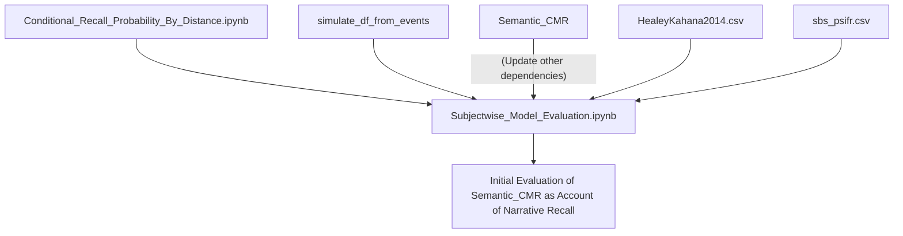

So I want to do more today than just finish the sem_crp notebook.

I want to also make the `simulate_df_from_events` function work within `Subjectwise_Model_Comparison.ipynb`. How do I ensure this? The test is perhaps best done outside the model comparison notebook. Maybe I'll refactor functions from `Generic_Data_Operations.ipynb` so I can focus on developing demos and tests. If I can demonstrate that simulating an events array from `Basic_CMR` and `HealyKahana2014.csv` preserves item_string information, I'm ready for the moment.

Fixing sem_crp allows me to plot the data's sem_crp within the subjectwise model comparison. 

Fixing the `simulate_df_from_events` function makes it so I can plot the model's sem_crp within subjectwise model comparison.

Fixing functions required to fit variants of Semantic_CMR (e.g., a specialized data likelihood function) makes it so I can test ideas about how semantic organization works.

That still wouldn't get me to "new information for Sean," but it would prove my code is sufficiently robust.
To obtain novel findings, I would need to examine either new models (e.g., Landscape_CMR, Semantic_ICMR), new phenomena (e.g., semantic neighbor contiguity), or both.

What's the fastest route to something new for Sean?

Arguably, it's the neighbor contiguity analyses, not a new model. If I can show that the effect is real and that [[@morton2016predictive]] item-based cue model variant cannot account for it, then that would be big.

But is that so easy to do over the next few days? 
Before I can code up the initial analysis, I have to finish and validate my existing neighbor contiguity analysis code, probably reproducing the model simulation result from [[@siegel2014retrieved]].
I also have to prepare the data from PEERS4 to enable a semantic variant of the analysis.
I'll definitely need to also validate my codebase's ability to measure semantic organization effects by reproducing the sem_crp analysis from [[@morton2016predictive]].
This will be enough of a foundation to code up the analysis.
Then to prove my results are accurate, I'll also need a control condition. I guess that's the same analysis, but using low-similarity pairs instead of high-similarity pairs.
Then to prove my results are a problem for the model, I'll need the entire evaluation pipeline working for Semantic_CMR. Ugh.

What's the alternative path to a novel result? 
Just focus on getting the evaluation pipeline working for Semantic_CMR variants.
Then compare with Base_CMR and Landscape_CMR and ICMR and a possible Semantic_ICMR.
Semantic_ICMR might have room in the ICMR paper. Can include it as a demonstration of how to integrate the model with another theory (here, theories of semantic memory). This isn't a clear enough demonstration of that, though. Ideally, it would be a different task with different retrieval demands.

What about landscape_cmr? I can imagine writing a paper that critiques the landscape model. But this doesn't look like a clear path toward that. After all, I'm currently working with the Healy Kahana 2014 dataset. 

Actually, if I can get the sbs dataset working within the pipeline, then just fitting Base_CMR and Semantic_CMR and the Landscape Model and Landscape_CMR would be enough to give Sean new information and drive further research. Is that what I should aim for? Hmm.

So I get the fitting pipeline working for Semantic_CMR and the Healey Kahana dataset, reproducing the sem_crp analysis result from [[@morton2016predictive]]. Then I make the sbs narrative recall dataset work in the same context. Next Monday, I show Sean how good CMR already is at accounting for narrative recall before further development. From there, I work on the backward inference line. Okay.

Now what? I need to clarify where distances come in. Should I make a separate report template? What will differ?

I'll need a separate template parameter that specifies the distance metric. 
Fine.

I'll need to validate the metric somehow in my validation cell. 
Just initialize the relevant cost function that uses the distance metric. Okay.

I'll need a clean way to pass distances or distance metric into my cost function. 
If the cost function is going to be numba compiled, I'll need to compute the distance matrix separately. 
`generate_objective_function` can optionally take a distance_metric argument to generate relevant distances before numba compilation and pass parameters to an appropriate likelihood function.

The likelihood function is supposed to operate across many trials and normally uses a trials array. To accomodate item repetitions, I created a variant that takes and handles a `presentations` argument. This time, it can use a distances argument. It seems like the structure will have to be a 3D array that tracks the distance matrix for each trial. To accomodate variable list lengths across trials, I'll made the second and third dimensions of this array equal the maximum list length and subset appropriately based on the provided trials array. Will I also need a presentations argument? Yeah, probably.

The main difference from `lohnas_data_likelihood` (which might instead be called `data_likelihood_with_variable_presentations`) is that `data_likelihood_with_variable_distances` will initialize models with a distance matrix based on the trial index and the distances argument.

Rest of cells won't be different until I'm trying to simulate statistics that also depend on a distance metric. To avoid unexpected argument errors, I'll only add the argument if distance_metric is not None. 

This is...inefficient code. I'll be recomputing the same distances over and over again. But the distance calculation happens outside of numba, so I may be able to enable caching or another time-saving technique without much difficulty. 

Okay, time to work. Geez.

I have to make my own sem_crp function. But first I need to correctly generate the distances matrix. First I need a list of item_strings from the events df that can be subsetted with the same arguments that I use to subset trials. Is that possible? It looks like I cannot because it's an item-level feature. So it looks like I'm tackling this problem earlier than planned.

Okay, so current push: retrieve a list of each item_string in a trial. How?

Let's do it the same way I extract presentations.
pivot_table doesn't seem to handle item_strings right.
Changing the agg_function away from `np.sum` seems to work. But the one suggested at https://stackoverflow.com/questions/34442214/pivoting-a-pandas-dataframe-containing-strings-no-numeric-types-to-aggregate will grow the string if there are repeats. Instead I want to just use the first item_string.
Okay, there are some built in aggregation functions: 

-   `count` / `nunique` – non-null values / count number of unique values
-   `min` / `max` – minimum/maximum
-   `first` / `last` - return first or last value per group
-   `unique` - all unique values from the group
-   `std` – standard deviation
-   `sum` – sum of values
-   `mean` / `median` / `mode` – mean/median/mode
-   `var` - unbiased variance
-   `mad` - mean absolute deviation
-   `skew` - unbiased skew
-   `sem` - standard error of the mean
-   `quantile`

I'll use first. We pass this argument to aggfunc as a string.

How do I fit this retrieved item level information into my simulation code?

Presentation and trial are both item-level information arrays. When I just want the unique items, I can set column to item like so:

`events.pivot_table(index=['subject', 'list'], columns='item', values='item_string', dropna=False, aggfunc='first')`

but if I want item level features for each study or recall event, I'll want:
- column to be "input" when using study events. as long as there is only one input position per trial, there will be no conflict. 
- column to be "output" when tracking recall events.

Then I grab the relevant piece of information as a vector like I would grab presentation or trial. And add the information to the list.

The only thing missing from this is an account of when a feature is a trial-level or item-level element. I can't assume one or the other uniformly anymore. 

I'll have to specify a {column_name: is_item_level} dictionary named `is_item_level` and from there handle columns differently based on the mapped value. Should I try to implement this now? My head is in it, so it's more efficient if I do, I guess.

It looks like for study keys it's sufficient to only pair item strings with study events. I don't have to worry about the recall events. Do I want a nan for invalid recall events? I'm already excluding invalid recall events. 

list_keys will apply to both study and recall eventsm even if they aren't paired with recall or study events, respectively. recall_keys will always apply to recall events, but not necessarily to study events that don't have a corresponding recall event.

If I may handle intrusions later, it's simplest to stick with list_keys. In my data prep, it's important to exclude intrusions though. 

Okay, this seems fixed.

Now I'm confused about how to handle the way some components of my analysis are trial specific and others are cross-trial -- for example, my edges.

This isn't that big a deal. The distance metric is another global parameter that I am not weighing this tradeoff for. 

Can I bear to compute distances and other values at the df level? It might simplify things downstream. But how would I later collapse semantics to trial level? 

Give each item_string a string_index scaling from 0 up. Store distances based on indices. Retrieve distances by passing vectors of indices to this array. But what about repeats and so on? Vector will have to be pulled from an item-column pivot. Okay, that's doable. 

To be clear...I would extract item_strings outside the loop to compute distances, and sort the distances using string indices. I'd also configure edges like that.

Then inside the loop, I would extract the string index sequence for each relevant trial, and generate a trial-specific distance matrix from that.

And if I don't do that? 

I still need to compute edges outside the subject loop.  At the moment, I just have subject strings. If edges depend on distances then...I need a different way to represent strings. `pd.unique(events.item_string)` gets me a quick vector. And then that's easy to embed and convert to a distance matrix.

How do I get edges from that? Make the diagonal all nans. Okay, this works. Though it's inefficient.

Now the actual sem_crp code.

It's adequate! What next? I'll have to review these notes. Decent time to transition home. 

If I want to make the code faster, I need to do the encoding more rarely; it is actually very time-consuming. But I'll worry about that later.