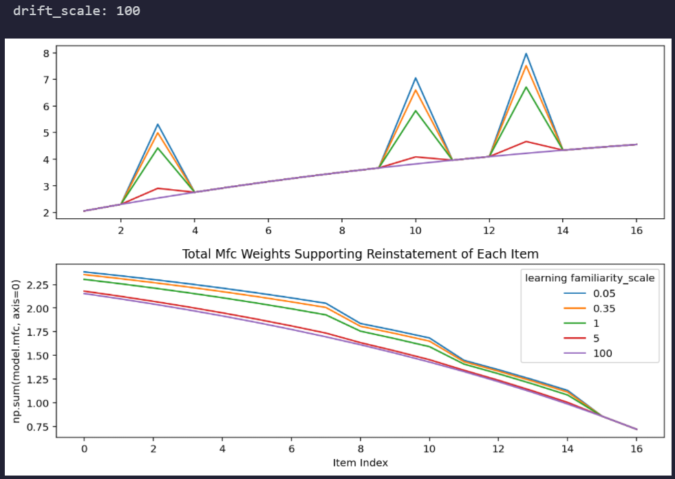
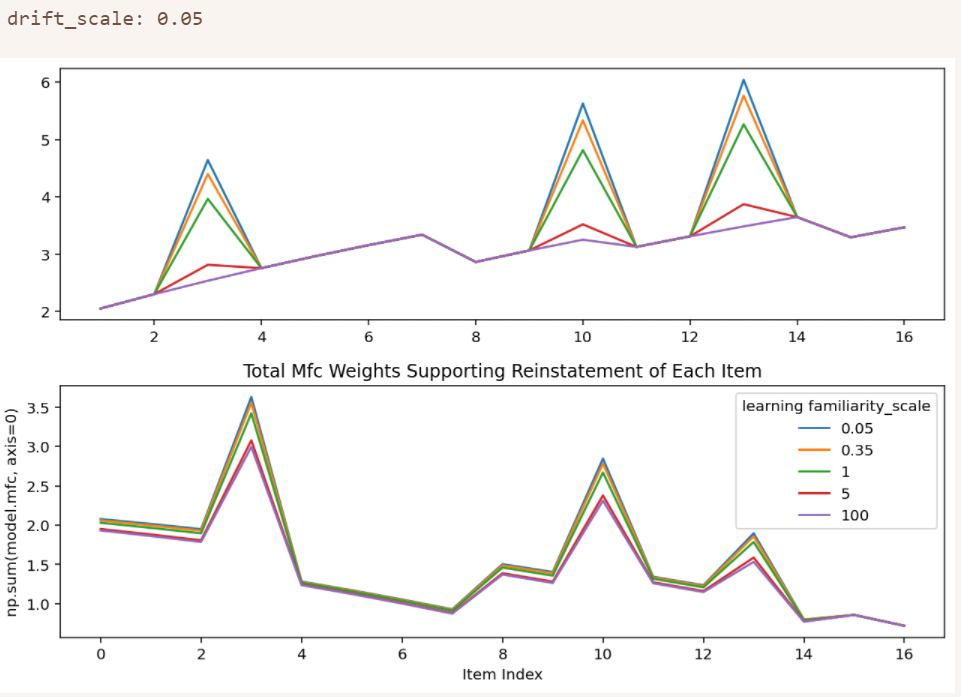

At high **drift scale**, MFC loses structure (it flatlines even in lists with item repetitions). A high drift scale corresponds to zero contextual drift for even minimally familiar items. Mcf on the other hand is left intact. On the other hand, evidence of factors like study phase retrieval (bumps in MCF weights near repeated presentations) do seem to disappear in MCF (in MFC, too). In other words, slowing drift rate seems to have a lot of unanticipated consequences for model performance. Presumably because, again, keeping contextual drift at the same state for two learning events is not a good idea. 

---

Bumps near the second presentation of an item in MCF weights are presented across familiarity scale results. This bump is for item 7, which occurs right before the second presentation of item 3. Now, why would MCF familiarity scale not affect this result? The relevant learning event must not be the presentation of item 3. 

#TODO: explain where the bump comes from and why it's not modulated by familiarity scale (though by drift scale)

We know not slowing contextual retrieval is important for producing this effect. So that lends credence to the reminding account of this weight bump. But don't we need associative learning for reminding to lead to a bump in MCF weights? How can the learning strength of the repetition not matter?

Freeing just the drift rate for suppression actually selects for a near-0 value, implying the parameter search disfavors suppressed contextual drift. Happens no matter what combination of parameters.

#TODO: Explain why does the model fit the drift scale parameter this way in this scenario? 

Freeing MFC rate actually results in pretty strong suppression, resulting in suppressed negative transitions for secondary presentations, the opposite of what I actually see in my data. Fits are worse though, so whatever. We see this effect wherever MFC is freed, even in the 3 param condition. Maybe I should exclusively make that line flat? It does seem well motivated...

#TODO: Explain why does the model fit the mfc scale parameter this way in this scenario? 

Freeing MCF rate doesn't affect the spacing curve at all. Spacing effect curve isn't stunning either. Massed repetition improves recall rate; that's important to predict from CMR.

Base CMR accounts for the improved memory of mass repeated items, but gets the slope wrong otherwise. Surprisingly, none of my model fits seem to actually improve fits to spacing curve. Suppressed learning of massed repetitions obviously runs counter to what we can see in data. Maybe rather than looking at flat values, I should consider setting a floor?

So each approach is a bit broken.
- MCF scale doesn't affect the differential contiguity effect except by reducing overall (???) temporal organization. And at high values, it suppresses the beneficial mnemonic effect of massed repetition. Nonetheless, including it improves overall fits. Fitted values are moderate (like around 1).
- MFC scale doesn't apparently affect the spacing effect curve (it may flatten it slightly). It does work to reduce the rate of negative transitions for second presentations (without affecting positive). Fitted values are always quite high to the extent that negative transition suppression exceeds that apparent in the data, even when drift rate is allowed to be slowed. 
- Drift scale is normally fitted to a neutral value (near 0), even though it's the only lever we know of that might account for the main part of the differential contiguity effect - a strongly suppressed rate of transitions to enar positive lags of the second presentation. Same fits as otherwise due to neutral fit values. Odd that MFC doesn't also do this.

So each one alone has an issue. MCF isn't even part of the differential contiguity issue, but it still has negative consequences for the spacing effect. It's the one that works the best alone, though - half as much an improvement as the delay_rate_drift parameter added.

All the params together fit to 29579 instead of 29728, and that's substantial. But qualitative predictions are off and I don't like that. A slight improvement comes from considering the flat modulation hypothesis for all parameters, but it's so slight that I hardly believe it. 

I will entertain the flat modulation hypothesis for MFC scale, based on the idea that it configures high acceleration to ensure spaced-out repetitions are suppressed. 

Altogether, the neutral fitted value of the drift scale and very strong fitted value for mfc scale suggests that parameter search finds a low rate of transition to nearby negative lags from second presentations very valuable - even as my behavioral data finds little evidence of a suppression. What could that mean?

Another possibility is that maybe an increased drift rate really is a better explanation of these results. How would that work? Stronger reinstatement of experimental memories exaggerates support for retrieval of the first context. But wouldn't this also contribute to worse negative lag transitions? And wouldn't it show up in my flat fitting? Yes, on both counts. But i haven't tried the flat modulation approach just for drift rate. I'll do that now.

When that fails, the failure will likely look like the base model performance. Still, it will be useful to see if the configured drift rate is higher or lower than the baseline encoding drift rate. In general though, extra contextual drift exaggerates differences between negative lag transition rates while suppressing differences between positive lag transition rates, the opposite of the pattern I'm interested in. So that discredits the reminding account of the effect. Why? Fast contextual drift extinguishes prior contextual activation while reinstating the context form the first presentation. Paradoxically though, when we fit the model, an accelerated drift rate is exactly what's produced.

What do we want instead? We want to keep (or reduce) the overall rate of contextual drift so that information about negative lags aren't too rapidly extinguished. OR we want to 

But 

(contextual drift <= baseline so negative transitions aren't suppressed) OR (learning rate for MFC is increased to compensate?)

For the 3/4 dataset, the main deficit is that the forward lag difference is too small while the negative lag difference is too big and the slope suppression is too strong too. Configured transition rates are fine overall. Critically, the model with these parameters configures no repetition effect for massed repetitions, which is a bit absurd. Setting MCF scale to 0 resolves this, but the question still remains of why the value was configured so highly in the first place. Setting the parameter value to 0 produces the same differential contiguity plot.

Still, a lower MCF scale seems to slightly throw off overall transition rates. 

What idea do I consider next? 

A floor so that there's always some learning no matter the amount of spacing from the repeated item. The hypothesis that there is no processing for mass-presented items cannot be entertained given the available evidence. At the same time, the effect should also be weaker at greater distances, too. I don't expect this adjustment to improve my differential contiguity curve fits, but I do expect they'll make my spacing curve more reasonable. 

What's my real problem? Reduced drift rate is my only lever for exaggerating primary and secondary positive lag transition rate differences. But the parameter search prefers to exaggerate negative lag transition rate differences, which drift rate reduction reduces. 

I need to implement noisy constant drift. This would avoid slowing the extinguishing of information from prior encodings, but still weaken positive lag associations wrt to secondary presentation. 