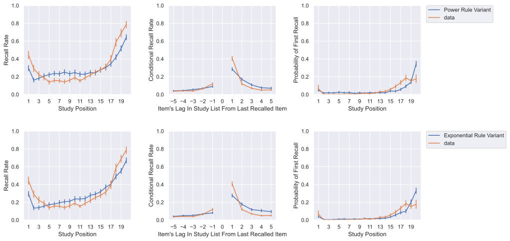
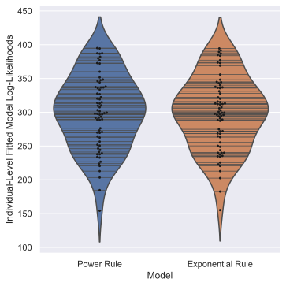

# Comparing Classic CMR Sampling Rules using the Murdock 1970 Dataset

We were curious whether the dampened temporal contiguity and other discrepancies apparent even for fitted parameter configurations of CMR is a result of our use of a power rule to control how much to distinguish the activations of highly-supported items relative to those of less supported items during calculation of recall probabililities. 

Under the classic exponential rule, the probability of recalling an item conditional on not termining recall is found by:

$$
P(i) = (1-P(stop))\frac{exp(\frac{2a_i}{\tau})}{\sum_{k}^{N}exp(\frac{2a_k}{\tau})}
$$

Under the power rule (newer but preferred for most initial work here), this probability is found by:

$$
P(i) = (1-P(stop))\frac{a^{\tau}_i}{\sum_{k}^{N}a^{\tau}_k}
$$

We fit versions CMR using each sampling rule to the \citet{murdock1970interresponse} dataset and considered both the sum of log-likelihoods computed over the dataset for each model's fitted parameter configuration, as well as corresponding summary statistics.

**NOTE**: Using the exponential rule as originally specified resulted in systematic numeric overflow errors, as the exponential of large numbers is VERY large. I used the exp-normalize trick reviewed [here](https://timvieira.github.io/blog/post/2014/02/11/exp-normalize-trick/) to evaluate outcome probability distributions in a way that avoided the issue.

## Summary Statistics

The fitted log-likelihoods for each model were 22973.17676475807 for the power rule variant and 22929.046815511352 for the exponential rule variant.

## Individual Fits

|       |   Exponential Rule |   Power Rule |
|:------|-------------------:|-------------:|
| mean  |           297.988  |     299.435  |
| std   |            53.7617 |      54.2917 |
| min   |           155.208  |     154.257  |
| 25%   |           261.233  |     261.036  |
| 50%   |           299.379  |     299.031  |
| 75%   |           336.484  |     336.856  |
| max   |           394.455  |     394.988  |

## Conclusion
Once you get the numerical overflow stuff out of the way (in retrospect, MATLAB seems to better handle this sort of issue) and fit the parameters, the models do about the same here. Still, there are some somewhat striking differences between the summary statistic lines here, even after fitting.
